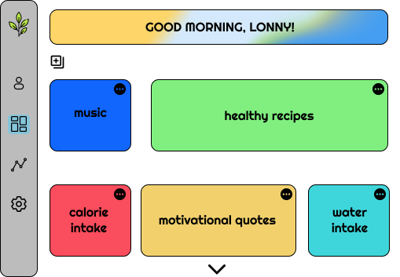

# CodeSociety-v23.1-Capstone Outline

Google Doc: https://docs.google.com/document/d/1BLjdCsO0Ekqtcq12JdOeMl2thNCkg2QvJdwxypEtHFo/edit?usp=sharing
## Outine

## Overview 
The Dashboard is a web app that acts as an all-in-one center hub for everything health-related. Whether you’re trying to get your weight up in the gym, meditate, or get your sleep schedule back on track, this dashboard will help you start healthy habits and be your best self physically and mentally. Users can see their stats for their fitness goals, getting reminders to workout or drink water, finding diets/recipes to fit their lifestyle, seeing motivational quotes, mindfulness tips, etc. Everything health, good vibes, and positivity is here.

## Functional Requirements (** - Part of the MVP)
### User Management:
  - User Registration: As a new user, I want to create a profile with my username, email, and password so that I can access the application.
  - Adding Health Stats: As a registered user, I want to add health stats (such as height, weight, goals, etc.) to my profile so that I can track my health progress.
  - Viewing Health Profile: As a registered user, I want to view my entire health profile, including my profile picture, username, email, health stats, and graphs, to monitor my health and progress.
  - Authentication: As a user, I want to log in and log out of my account securely to protect my data and ensure privacy.
  - Editing Account Information: As a registered user, I want to edit my account information (username, email, password, etc.) to keep it up-to-date.
  - Deleting Profile: As a registered user, I want to delete my profile, which will redirect me to the signup/login page, in case I no longer want to use the application.

### Widgets:
  - Viewing Saved Widgets: As a user, I want to view the widgets I have saved on the dashboard screen for quick access to my health data.
  - Opening Widgets: As a user, I want to select and open a widget to see detailed information and insights related to my health.
  - Organize/Move Widgets on Dashboard: As a user, I want to drag, move, and organize widgets on the dashboard screen to customize my health monitoring experience.
  - Deleting Widgets: As a user, I want to delete widgets that are no longer relevant or useful to declutter my dashboard.
  - Adding New Widgets: As a user, I want to add new widgets to my dashboard by clicking the "+" button and selecting from a catalog of premade widgets.
  - Widget Catalog Selection: As a user, I want to browse the widget catalog and select the widgets I want to add to my dashboard.
  - Customizing New Widgets: As a user, when adding a new widget, I want to provide the necessary data to customize the widget to my specific health goals and needs.
  - Saving Dashboard Layout: As a user, I want to save the layout and order of widgets on my dashboard to maintain my preferred setup.
  - Adding Mandatory Widget (Onboarding): As a new user, after creating an account, I want to be guided to add at least one widget to my dashboard to get started with the application.

## Non-Functional Requirements
### Performance:
  - Response Time: The system should respond to user interactions within an acceptable time frame, with most operations completing in seconds.
  - Scalability: The application should be designed to handle an increasing number of users and widgets without significant performance degradation.

### Security:
  - Authentication and Authorization: User authentication should be secure, and access to user data should be restricted based on user roles and permissions.
  - Data Encryption: Sensitive user data, including passwords and health stats, should be stored and transmitted securely using encryption protocols.
  - Data Privacy: The application should comply with relevant data privacy regulations, and user data should be handled with strict confidentiality.

### Usability:
  - User-Friendly Interface: The user interface should be intuitive and easy to use, with clear instructions and minimal learning curve.
  - Accessibility: The application should be accessible to users with disabilities, following accessibility guidelines and standards.

### Reliability:
  - Availability: The system should be available for use 24/7 with minimal downtime for maintenance and updates.
  - Backup and Recovery: Regular data backups should be performed, and a robust data recovery mechanism should be in place in case of data loss

### Compatibility:
  - Cross-Browser Compatibility: The application should work correctly and consistently across major web browsers (e.g., Chrome, Firefox, Safari).
  - Cross-Device Compatibility: The application should be responsive and function well on various devices, including desktops, tablets, and smartphones.

### Maintainability:
  - Code Maintainability: Code should be well-documented, structured, and follow best practices to facilitate ongoing development and maintenance.
  - Scalable Architecture: The application's architecture should support future enhancements and changes without major rework.

### Performance Testing:
  - Load Testing: Perform load testing to ensure the system can handle concurrent user sessions and widgets without degradation in performance.
  - Security Testing: Conduct security testing, including penetration testing, to identify and mitigate vulnerabilities in the application.

### Compliance:
  - Regulatory Compliance: Ensure that the application complies with relevant industry standards and regulations, such as healthcare data security standards (if applicable).

